# 💳 Static QR Payment System & Global Payment Management Guide (EMS)
### *Comprehensive Architecture, Static QR Standee Configuration, Candidate Checkout, and Forensic Payment Ledger*

---

## 📌 1. Executive Summary

Instead of automated merchant API integration with external payment gateways, the **Election Management System (EMS)** utilizes a **Static QR-based Payment & Verification Architecture**.

Organizations and Election Committees provide their official static bank/wallet QR code standees (e.g. FonePay, eSewa, Khalti, ConnectIPS, or Bank QR), configure fee requirements with a **Global Master Switch (ON / OFF)**, collect transaction proof & voucher screenshots, and review submissions in a centralized **Forensic Payment Ledger**.

---

## 🎯 2. Primary Capabilities & Features

```
┌──────────────────────────────────────────────────────────────────────────────────┐
│                   STATIC QR PAYMENT SYSTEM IN EMS                                │
├─────────────────────────┬──────────────────────────┬─────────────────────────────┤
│ 1. GLOBAL ON/OFF SWITCH │ 2. STATIC QR & BANK INFO │ 3. CANDIDATE PROOF CHECKOUT │
├─────────────────────────┼──────────────────────────┼─────────────────────────────┤
│ • Master toggle in      │ • Upload official QR     │ • Candidates scan QR        │
│   Payment Settings.     │   standee image.         │   from checkout modal.      │
│ • When OFF: Nomination  │ • Set Bank Name, A/C No, │ • Input Txn ID / Reference. │
│   is 100% free/instant. │   A/C Name, Wallet ID.   │ • Upload voucher image.     │
│ • When ON: Candidates   │ • Custom instructions    │ • Auto-creates Pending      │
│   must submit payment.  │   & remarks guide.       │   Payment record in ledger. │
└─────────────────────────┴──────────────────────────┴─────────────────────────────┘
```

---

## 🏗️ 3. End-to-End Workflow

```mermaid
graph TD
    subgraph 1. Admin / Organization Configuration
        A[Admin opens Payment Settings] --> B[Toggle Global Payment Switch ON / OFF]
        B --> C[Upload Official Static QR Image]
        C --> D[Enter Bank / Wallet Account Details]
        D --> E[Set Default Nomination Fee & Instructions]
        E --> F[Save Settings to Organization Profile]
    end

    subgraph 2. Candidate Nomination Flow
        G[Candidate fills Nomination Form] --> H{Is Payment ON & Fee > 0?}
        H -- No (Free / OFF) --> I[Direct Submission -> Status: SUBMITTED]
        H -- Yes (Payment ON) --> J[Display Static QR Checkout Modal]
        J --> K[Candidate scans QR & pays via Mobile Banking]
        K --> L[Candidate enters Txn ID & uploads Voucher Screenshot]
        L --> M[Submit Nomination -> Payment Status: PENDING_VERIFICATION]
    end

    subgraph 3. Election Officer Verification
        N[Officer opens Payment History Ledger] --> O[Filter Pending / Verified / Rejected]
        O --> P[Inspect Transaction ID & Full-Screen Voucher Image]
        P --> Q{Officer Scrutiny Decision}
        Q -- Approve --> R[Verify Payment -> Mark Candidate PAID -> Unlock for Scrutiny]
        Q -- Reject --> S[Reject Payment -> Input Reason -> Candidate can re-submit proof]
    end
```



---

## 💻 4. Backend Implementation (Django REST Framework)

### Database Models

1. **`Payment` (`backend/apps/billing/models.py`)**:
   - `organization`: Tenant organization FK.
   - `election`: Associated election FK.
   - `candidate`: Candidate nomination FK.
   - `user`: Submitting payer user FK.
   - `amount`: Payable fee in NPR.
   - `payment_method`: `static_qr_bank`, `static_qr_wallet`, `bank_transfer`, `cash_voucher`.
   - `transaction_reference`: Unique transaction ID or voucher reference number.
   - `receipt_image_url`: Uploaded screenshot of the payment receipt.
   - `payment_notes`: Candidate remarks/notes.
   - `status`: `pending`, `verified`, `rejected`, `completed`, `failed`.
   - `reviewed_by`: Officer/Admin who scrutinized the transaction.
   - `reviewed_at`: Timestamp of verification.
   - `rejection_reason`: Explanatory notes if returned to candidate.

2. **`Candidate` (`backend/apps/candidates/models.py`)**:
   - `payment_status`: `unpaid`, `pending_verification`, `paid`, `waived`.

3. **`Organization` (`backend/apps/organizations/models.py`)**:
   - `payment_settings`: JSON dictionary containing `is_payment_enabled`, `qr_image_url`, `bank_name`, `account_name`, `account_number`, `branch`, `wallet_type`, `wallet_id`, `default_nomination_fee`, `instructions`.

### REST API Endpoints

| Method | Endpoint | Description | Permission |
|---|---|---|---|
| `GET` | `/v1/payments/` | List payments (filtered by `status`, `election`, `q`) | Officer / Candidate (own) |
| `GET` | `/v1/payments/stats/` | Aggregated revenue and verification metrics | Officer / Admin |
| `POST` | `/v1/payments/<id>/verify/` | Mark payment as Verified/Approved | Officer / Admin |
| `POST` | `/v1/payments/<id>/reject/` | Reject payment proof with reason | Officer / Admin |
| `POST` | `/v1/payments/<id>/resubmit/` | Re-submit updated voucher/Txn ID | Payer / Candidate |
| `GET` | `/v1/elections/<id>/payments/` | List payments for specific election | Officer / Admin |

---

## 📱 5. Frontend Screens (Flutter)

1. **Payment Settings (`/payment-settings`)**:
   - Master Switch: Toggle payment system ON/OFF.
   - QR Standee Uploader: Image picker for official QR code.
   - Bank Account Information: Bank Name, Account Holder Name, Account Number, Branch.
   - Live Candidate Modal Preview: Interactive demonstration card.

2. **Candidate Nomination Form (`/elections/:id/nominate`)**:
   - Automatically checks global payment toggle and designation fee.
   - If payment is required: opens Static QR Checkout dialog displaying QR code, amount, and 1-click copy-able account number.
   - Collects Transaction ID and voucher screenshot.
   - Displays payment status chip (`Pending Verification`, `Verified`, `Rejected`) on "My Nominations" card.
   - Allows candidates to re-submit proof if rejected.

3. **Payment History & Ledger (`/admin/payments`)**:
   - Accessible from Admin Drawer under "Finance & Payments".
   - Top metrics: Total Verified Revenue, Pending Review Count & Amount, Rejected Count.
   - Filters: All, Pending, Verified, Rejected, Filter by Election.
   - Search by Txn ID, Candidate Name, or Email.
   - High-resolution interactive lightbox viewer for payment vouchers.
   - One-click **Verify & Approve** and **Reject** actions.

---

## 🧪 6. Verification Status

| Subsystem | Test Description | Status |
|---|---|---|
| **Database Migrations** | `candidates.0008` & `billing.0003` applied | ✅ Complete |
| **Backend Test Script** | `test_static_payments.py` ran end-to-end | ✅ Passed |
| **API Endpoints** | `/v1/payments/`, `/verify/`, `/reject/`, `/stats/` | ✅ Active |
| **Flutter Screens** | Payment Settings, Nomination Modal, Admin Ledger | ✅ Implemented |
| **RBAC Permissions** | Admins & Officers can verify; Candidates see own | ✅ Enforced |
