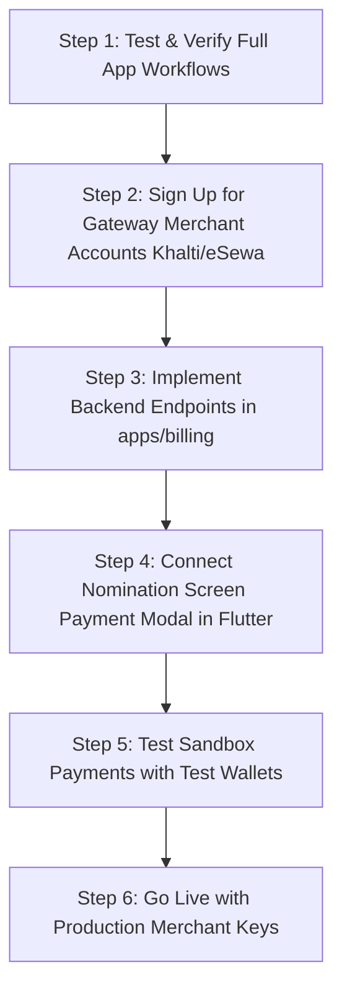

# 💳 Payment Gateway Integration Guide (EMS)
### *Comprehensive Architecture, Code Review, and Implementation Blueprint for Khalti, eSewa, and Stripe*

---

## 📌 1. Executive Summary & Existing Codebase Audit

The **Election Management System (EMS)** already has foundational database columns and dedicated architecture ready for monetization and fee collection.

### 🔍 Existing Foundations in the Codebase:
1. **Candidate Nomination Charge** (`backend/apps/elections/models.py` lines 94–96):
   - `is_paid_candidacy` (`BooleanField`, default=`False`): Toggles whether candidate applications require a filing fee.
   - `nominee_charge` (`DecimalField`, default=`0.00`): The statutory nomination fee (in NPR) required per position.
2. **Billing & Subscription Models** (`backend/apps/billing/models.py`):
   - `SubscriptionPlan`: Tiered packages (`Free`, `Starter`, `Growth`, `Enterprise`) with `price_npr`, `voter_cap`, `max_active_elections`, `includes_sms`, `includes_audit_export`.
   - `Subscription`: Organization active subscription tracking period start and end.
   - `Payment`: Audit ledger with `gateway` choices (`khalti`, `esewa`, `stripe`), `amount`, `currency`, `status` (`pending`, `completed`, `failed`), and `gateway_reference`.

---

## 🎯 2. Primary Payment Use-Cases in EMS

```
┌─────────────────────────────────────────────────────────────────────────────┐
│                          EMS PAYMENT USE-CASES                             │
├──────────────────────────────────────┬──────────────────────────────────────┤
│ 1. CANDIDATE NOMINATION FILING FEE   │ 2. SAAS SUBSCRIPTION & QUOTA UPGRADE │
│    (उम्मेदवारी दर्ता दस्तुर)         │    (संस्थागत योजना तथा सदस्यता)     │
├──────────────────────────────────────┼──────────────────────────────────────┤
│ • Trigger: Candidate filing for an   │ • Trigger: Organization admin        │
│   election where `is_paid_candidacy` │   creates election exceeding Free    │
│   = True.                            │   voter cap (e.g. >200 voters).      │
│ • Payer: Individual Candidate        │ • Payer: Organization Owner/Admin    │
│ • Target: Election Committee / Org   │ • Target: EMS Platform Account       │
│ • State Transition:                  │ • State Transition:                  │
│   `DRAFT` ➔ `PAYMENT_PENDING` ➔      │   `Subscription.status = 'active'`   │
│   `SUBMITTED` (Sent for Scrutiny)    │   voter limit unlocked.              │
└──────────────────────────────────────┴──────────────────────────────────────┘
```

---

## 🏗️ 3. Payment Gateway Architecture (Adapter Pattern)

To keep the codebase modular and easily extensible to multiple payment providers, implement the **Gateway Adapter Pattern**:

```
                  ┌───────────────────────────────┐
                  │    BasePaymentGateway (ABC)   │
                  └───────────────┬───────────────┘
                                  │
         ┌────────────────────────┼────────────────────────┐
         ▼                        ▼                        ▼
┌──────────────────┐    ┌──────────────────┐    ┌──────────────────┐
│  KhaltiGateway   │    │   EsewaGateway   │    │  StripeGateway   │
│  (ePayment v2)   │    │     (ePay v2)    │    │ (Int'l Cards)    │
└──────────────────┘    └──────────────────┘    └──────────────────┘
```

---

## 💻 4. Backend Implementation Plan (Django)

### A. Environment Variables (`.env`)
```ini
# Khalti Credentials
KHALTI_PUBLIC_KEY="Key live_public_key_xxxx"
KHALTI_SECRET_KEY="Key live_secret_key_xxxx"
KHALTI_BASE_URL="https://a.khalti.com/api/v2"  # https://dev.khalti.com/api/v2 for sandbox

# eSewa Credentials
ESEWA_MERCHANT_CODE="EPAYTEST"
ESEWA_SECRET_KEY="8gBm/:&EnhH.1/q"
ESEWA_BASE_URL="https://rc-epay.esewa.com.np/api/epay/main/v2/form"
```

### B. Gateway Service Implementation (`backend/apps/billing/services.py`)

#### 1. Khalti ePayment v2
```python
import requests
import json
from django.conf import settings

class KhaltiService:
    @staticmethod
    def initiate_payment(purchase_order_id, purchase_order_name, amount_paisa, return_url, website_url):
        """
        Initiates a Khalti ePayment session.
        amount_paisa: e.g. NPR 500.00 = 50000 paisa
        """
        url = f"{settings.KHALTI_BASE_URL}/epayment/initiate/"
        headers = {
            "Authorization": f"Key {settings.KHALTI_SECRET_KEY}",
            "Content-Type": "application/json"
        }
        payload = {
            "return_url": return_url,
            "website_url": website_url,
            "amount": int(amount_paisa),
            "purchase_order_id": str(purchase_order_id),
            "purchase_order_name": purchase_order_name,
        }
        response = requests.post(url, headers=headers, data=json.dumps(payload))
        return response.json() # Returns {'pidx': '...', 'payment_url': 'https://...'}

    @staticmethod
    def verify_payment(pidx):
        """
        Verifies payment status via server-to-server lookup.
        """
        url = f"{settings.KHALTI_BASE_URL}/epayment/lookup/"
        headers = {
            "Authorization": f"Key {settings.KHALTI_SECRET_KEY}",
            "Content-Type": "application/json"
        }
        response = requests.post(url, headers=headers, data=json.dumps({"pidx": pidx}))
        return response.json() # Returns {'status': 'Completed', 'transaction_id': '...'}
```

#### 2. eSewa ePay v2 (HMAC SHA-256 Signature)
```python
import hmac
import hashlib
import base64

class EsewaService:
    @staticmethod
    def generate_signature(total_amount, transaction_uuid, product_code=settings.ESEWA_MERCHANT_CODE):
        """
        Generates HMAC-SHA256 signature required by eSewa v2.
        Message format: "total_amount=100,transaction_uuid=11-201-13,product_code=EPAYTEST"
        """
        message = f"total_amount={total_amount},transaction_uuid={transaction_uuid},product_code={product_code}"
        secret_key = settings.ESEWA_SECRET_KEY.encode('utf-8')
        signature = hmac.new(secret_key, message.encode('utf-8'), hashlib.sha256).digest()
        return base64.b64encode(signature).decode('utf-8')
```

### C. REST API Endpoints (`backend/apps/billing/views.py`)

1. **`POST /api/v1/billing/nomination-fee/initiate/`**:
   - Accepts: `{ "candidate_id": "UUID", "gateway": "khalti" | "esewa" }`
   - Validates candidate status and calculates position filing fee.
   - Creates a pending `Payment` record and returns the gateway `payment_url` and `pidx`.

2. **`POST /api/v1/billing/nomination-fee/verify/`**:
   - Accepts: `{ "payment_id": "UUID", "pidx": "...", "transaction_id": "..." }`
   - Server queries Khalti/eSewa API to verify receipt of funds.
   - Atomically updates:
     - `Payment.status = 'completed'`
     - `Candidate.status = 'submitted'` (unlocks nomination for scrutiny)
     - Logs cryptographic audit trail entry in `AuditLog`.

---

## 📱 5. Frontend Implementation Plan (Flutter)

### A. Candidate Nomination Payment Modal
When a candidate completes their nomination form:
1. If `election.isPaidCandidacy == true`:
   - Display Fee Breakdown Card (e.g. *Nomination Fee: NPR 1,000*).
   - Render Gateway Selection Radios:
     - 🟣 **Khalti Wallet / Banking**
     - 🟢 **eSewa Mobile Wallet**
     - 🔵 **ConnectIPS / SCT Card**
2. On click **"Proceed to Pay & Submit"**:
   - Call `/api/v1/billing/nomination-fee/initiate/`.
   - On Flutter Web: Redirect or open secure pop-up window via `html.window.open(paymentUrl, '_blank')`.
   - On Flutter Mobile: Launch inside in-app `InAppWebView` or deep link back via App Links.
3. Callback Listener:
   - Poll or capture redirect with `pidx` token.
   - Send token to `/verify/` endpoint.
   - Display animated success seal with transaction reference `#TXN-XXX`.

---

## 🧪 6. Comprehensive E2E Application Verification Checklist
*(Perform this complete verification before enabling live payment gateway credentials)*

| # | Feature / Subsystem | Verification Steps | Status |
|---|---|---|---|
| **1** | **Authentication & RBAC** | Admin, Election Officer, Candidate, and Elector registration, token refresh, permission gating. | ✅ Ready |
| **2** | **Election Schedule Lifecycle** | Auto-transition through Draft ➔ Published ➔ Nomination Open ➔ Voting Open ➔ Results Final. | ✅ Ready |
| **3** | **Designations & Quotas** | Multi-seat positions, Female/Youth reservation quotas, slate groupings. | ✅ Ready |
| **4** | **Voter Management** | CSV bulk wizard, external API import, voter freeze date, claims/objection approvals. | ✅ Ready |
| **5** | **Candidate Dossiers** | Self-nomination, proposer/supporter signatures, photo uploads, committee scrutiny ruling. | ✅ Ready |
| **6** | **Ballot Cryptography** | Secret ballot encryption, FPTP & RCV voting, No Vote / Boycott option, receipt fingerprint generation. | ✅ Ready |
| **7** | **Tally & Live Results** | Automated tie-break detection, provisional vs certified final results publication, public dashboard. | ✅ Ready |
| **8** | **Forensic Audit Portal** | SHA-256 ledger integrity check, 64-character receipt hash validator, regulatory export package. | ✅ Ready |
| **9** | **Communications & Rules** | Multi-group email broadcasts, live delivery telemetry with retry, public notices, and guidelines editor. | ✅ Ready |

---

## 🚀 7. Next Steps & Recommended Implementation Sequence



1. **Verify Current App**: Run end-to-end election tests using the sandbox/dev environment.
2. **Review Payment Guide**: When you're ready to proceed with payment, we will implement the `KhaltiService`, `EsewaService`, and Flutter checkout dialog.
